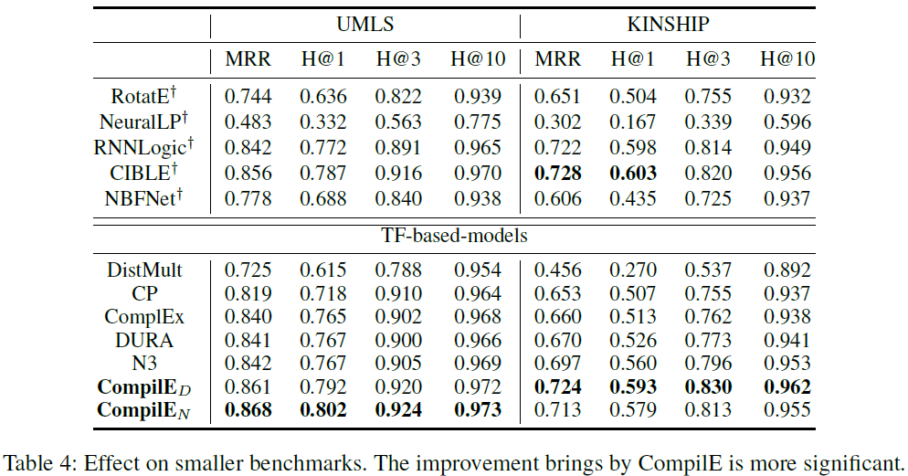

# Modeling Knowledge Graphs with Composite Reasoning

This is the code of paper 
**Modeling Knowledge Graphs with Composite Reasoning**. 

Wanyun Cui, Linqiu Zhang. AAAI 2024

### 1. Results
The results of **CompilE_D** and **CompilE_N** on **WN18RR**, **FB15k237**, **UMLS** and **KINSHIP** are as follows.

<p align="center">
  
</p>

<p align="center">
  
</p>

### 2. Reproduce the Results 
To reproduce the results of CompilE_D and CompilE_N on WN18RR, FB15k237, UMLS and KINSHIP,
please run the following commands.

```shell script
#################################### WN18RR ####################################
# CompilE_N
CUDA_VISIBLE_DEVICES=0 nohup python learn.py --dataset WN18RR --model ComplEx --rank 2000 \
--optimizer Adagrad --learning_rate 1e-1 --batch_size 100 --curri_learn --curri_epochs 40.0 --use_N3 --use_N3_weight 0.1 \
--save_path trained_models/wn/N3 \
--max_epochs 100 --valid 2 --data_path data \
--regularizer knn --mode_list "hrt-t-hrt;hrt-h-hrt" \
--n_pos 10 --w1 0 --w2 0 --w3 0.8 --fully_train \
> trained_models/wn/N3/gpu_0.out 2>&1 &

# CompilE_D
CUDA_VISIBLE_DEVICES=0 nohup python learn.py --dataset WN18RR --model ComplEx --rank 2000 \
--optimizer Adagrad --learning_rate 1e-1 --batch_size 100 --curri_learn --curri_epochs 40.0 --use_DURA_W --use_DURA_W_weight 0.1 \
--save_path trained_models/wn/dura \
--max_epochs 100 --valid 2 --data_path data \
--regularizer knn --mode_list "hrt-t-hrt;hrt-h-hrt" \
--n_pos 10 --w1 0 --w2 0 --w3 0.8 --fully_train --do_ce_weight \
> trained_models/wn/dura/gpu_0.out 2>&1 &

#################################### FB237 ####################################
# CompilE_N
CUDA_VISIBLE_DEVICES=0 nohup python learn.py --dataset FB237 --model ComplEx --rank 2000 \
--optimizer Adagrad --learning_rate 1e-1 --batch_size 100 --use_N3 --use_N3_weight 5e-2 --curri_learn --curri_epochs 40.0 \
--save_path trained_models/fb/N3 \
--max_epochs 100 --valid 2 --data_path data \
--regularizer knn --mode_list "hrt-rt-hr;hrt-hr-rt" \
--n_pos 10 --w1 0 --w2 0.2 --w3 0 --fully_train \
> trained_models/fb/N3/gpu_0.out 2>&1 &


# CompilE_D
CUDA_VISIBLE_DEVICES=0 nohup python learn.py --dataset FB237 --model ComplEx --rank 2000 \
--optimizer Adagrad --learning_rate 1e-1 --batch_size 100 --curri_learn --curri_epochs 40.0 --use_DURA_W --use_DURA_W_weight 5e-2 \
--save_path trained_models/fb/dura \
--max_epochs 200 --valid 2 --data_path data \
--regularizer knn --mode_list "hrt-rt-hr;hrt-hr-rt" \
--n_pos 10 --w1 0 --w2 0.05 --w3 0 --fully_train \
> trained_models/fb/dura/gpu_0.out 2>&1 &


#################################### UMLS ####################################
# CompilE_N
CUDA_VISIBLE_DEVICES=0 nohup python learn.py --dataset umls --model ComplEx --rank 2000 \
--optimizer Adagrad --learning_rate 1e-1 --batch_size 100 --curri_learn --curri_epochs 40.0 --use_N3 --use_N3_weight 0.005 \
--save_path trained_models/umls/N3 \
--max_epochs 100 --valid 2 --data_path data \
--regularizer knn --mode_list "hrt-rt-hrt;hrt-hr-hrt;hrt-t-hrt;hrt-h-hrt;hrt-hr-rt;hrt-rt-hr;hrt-hr-t;hrt-rt-h" \
--n_pos 10 --w1 0.4 --w2 1.0 --w3 0 --fully_train \
> trained_models/umls/N3/gpu_0.out 2>&1 &

# CompilE_D
CUDA_VISIBLE_DEVICES=0 nohup python learn.py --dataset umls --model ComplEx --rank 2000 \
--optimizer Adagrad --learning_rate 5e-2 --batch_size 100 --curri_learn --curri_epochs 40.0 --use_DURA_W --use_DURA_W_weight 0.001 \
--save_path trained_models/umls/dura \
--max_epochs 100 --valid 2 --data_path data \
--regularizer knn --mode_list "hrt-rt-hrt;hrt-hr-hrt;hrt-t-hrt;hrt-h-hrt;hrt-hr-rt;hrt-rt-hr;hrt-hr-t;hrt-rt-h" \
--n_pos 10 --w1 0 --w2 1.0 --w3 0 --fully_train \
> trained_models/umls/dura/gpu_0.out 2>&1 &


#################################### KINSHIP ####################################
# CompilE_N
CUDA_VISIBLE_DEVICES=0 nohup python learn.py --dataset kinship --model ComplEx --rank 2000 \
--optimizer Adagrad --learning_rate 1e-1 --batch_size 100 --curri_learn --curri_epochs 40.0 --use_N3 --use_N3_weight 0.05 \
--save_path trained_models/kinship/N3 \
--max_epochs 100 --valid 2 --data_path data \
--regularizer knn --mode_list "hrt-rt-hrt;hrt-hr-hrt;hrt-t-hrt;hrt-h-hrt;hrt-hr-rt;hrt-rt-hr;hrt-hr-t;hrt-rt-h" \
--n_pos 10 --w1 1.0 --w2 0.6 --w3 1.0 --fully_train \
> trained_models/kinship/N3/gpu_0.out 2>&1 &

# CompilE_D
CUDA_VISIBLE_DEVICES=0 nohup python learn.py --dataset kinship --model ComplEx --rank 2000 \
--optimizer Adagrad --learning_rate 5e-2 --batch_size 100 --curri_learn --curri_epochs 40.0 --use_DURA_W --use_DURA_W_weight 0.005 \
--save_path trained_models/kinship/dura \
--max_epochs 100 --valid 2 --data_path data \
--regularizer knn --mode_list "hrt-rt-hrt;hrt-hr-hrt;hrt-t-hrt;hrt-h-hrt;hrt-hr-rt;hrt-rt-hr;hrt-hr-t;hrt-rt-h" \
--n_pos 10 --w1 0.8 --w2 0.6 --w3 0.8 --fully_train \
> trained_models/kinship/dura/gpu_0.out 2>&1 &
```

## Acknowledgement
We refer to the code of [kbc](https://github.com/facebookresearch/kbc) and [DURA](https://github.com/MIRALab-USTC/KGE-DURA). Thanks for their contributions.
